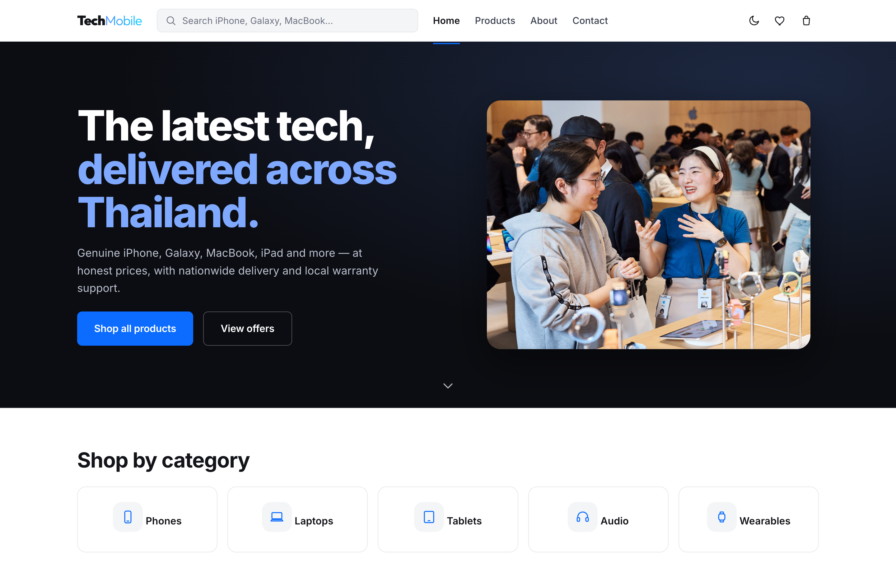
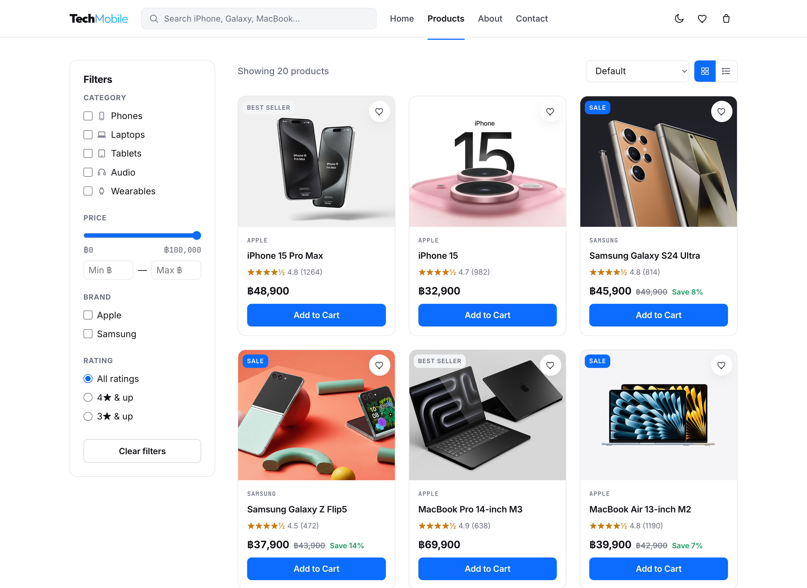
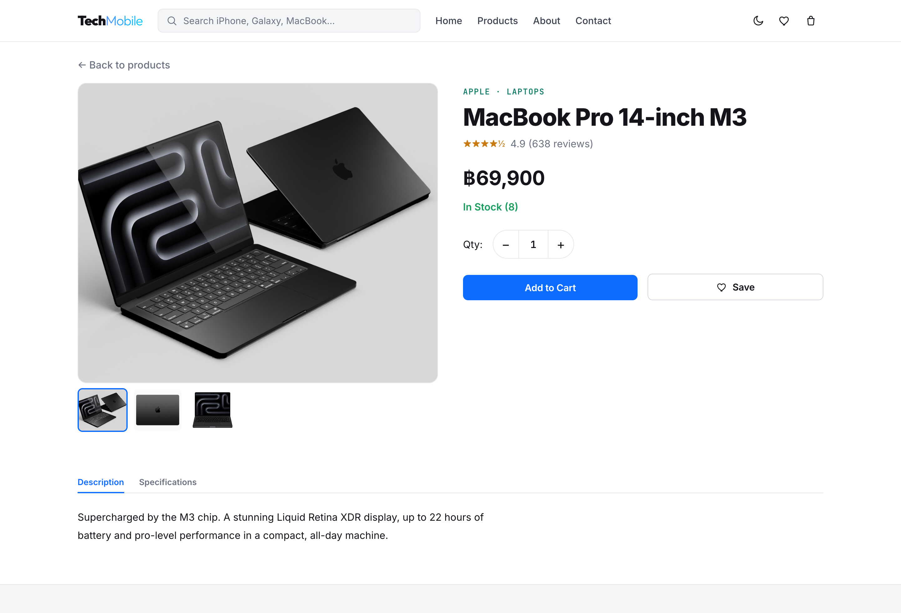
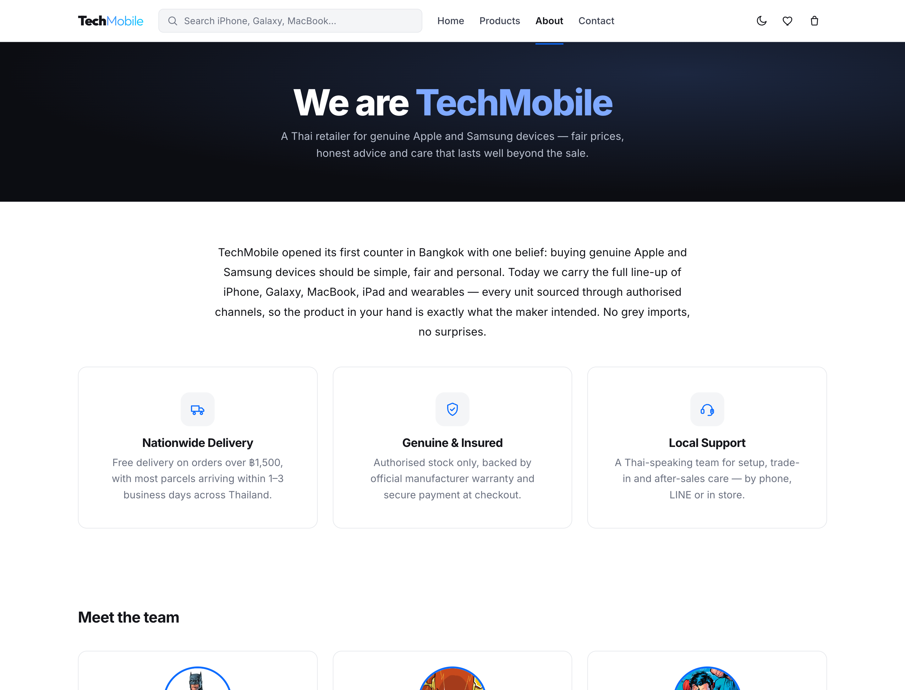

# TechMobile

A responsive, front-end e-commerce store for genuine **Apple & Samsung** devices, set in Thailand (prices in Thai Baht ฿). Built with **vanilla HTML, CSS and JavaScript** — no frameworks, no build step, no backend. All cart, wishlist and theme state is persisted in `localStorage`.

**🔗 Live demo: [vance1832.github.io/techmobile-ecommerce](https://vance1832.github.io/techmobile-ecommerce/)**



---

## Features

- **Product catalogue** — 20 real Apple & Samsung products across 5 categories (Phones, Laptops, Tablets, Audio, Wearables), each with specs, ratings, stock and an image gallery.
- **Filtering & sorting** — filter by category, brand, price range and rating; sort by price, rating or newest; grid/list views; deep-linkable via URL params (`?category=`, `?search=`, `?filter=sale`).
- **Live search** — debounced search across product name, description and category.
- **Product detail** — image gallery with thumbnails, quantity selector (stock-aware), and Description / Specifications tabs.
- **Cart** — add/update/remove items, live subtotal, VAT (7%) and free-shipping logic, persisted across pages.
- **Wishlist** — save/remove devices from any product card, with a dedicated wishlist page and live badge counts.
- **Checkout** — multi-step form with live card formatting, full client-side validation, and an order-confirmation screen with confetti.
- **Authentication (demo)** — login/register tabs with a password-strength meter and validation.
- **Dark mode** — persisted theme toggle with no flash on load.
- **Responsive** — mobile-first layout with a collapsible nav, filter drawer and adaptive grids.
- **Accessible** — semantic HTML, ARIA labels, `aria-live` badges, visible focus states and descriptive alt text.

## Screenshots

| Products | Product detail |
| --- | --- |
|  |  |

| About |
| --- |
|  |

## Tech stack

- **HTML5** — semantic markup
- **CSS3** — custom properties (theming), Flexbox & Grid, media queries
- **JavaScript (ES Modules)** — no dependencies
- **localStorage** — cart, wishlist and theme persistence

## Project structure

```
.
├── index.html            # Home / hero
├── products.html         # Listing with filters & sort
├── product-detail.html   # Single product + gallery
├── cart.html             # Shopping cart
├── checkout.html         # Checkout form
├── wishlist.html         # Saved devices
├── login.html            # Login / register (demo)
├── about.html            # About us
├── contact.html          # Contact form
├── css/                  # variables, base, and per-section styles
├── js/                   # data, cart, wishlist, ui, filters, page controllers
├── assets/images/        # product, team & hero photography
└── screenshots/          # README screenshots
```

## Getting started

The app uses **ES Modules**, which browsers block over the `file://` protocol. Serve it over HTTP instead:

```bash
# from the project root
python3 -m http.server 8000
# then open http://localhost:8000
```

Any static server works (e.g. `npx serve`, the VS Code Live Server extension, etc.).

## Notes

- This is a **front-end demo** — there is no real backend, authentication or payment processing. Card numbers entered at checkout are not stored or transmitted.
- Prices are illustrative and shown in Thai Baht (฿).
- Product, team and store photography is sourced from free-licensed providers (Wikimedia Commons, Unsplash, randomuser.me). "Apple", "Samsung" and product names are trademarks of their respective owners and are used here for demonstration purposes only.
